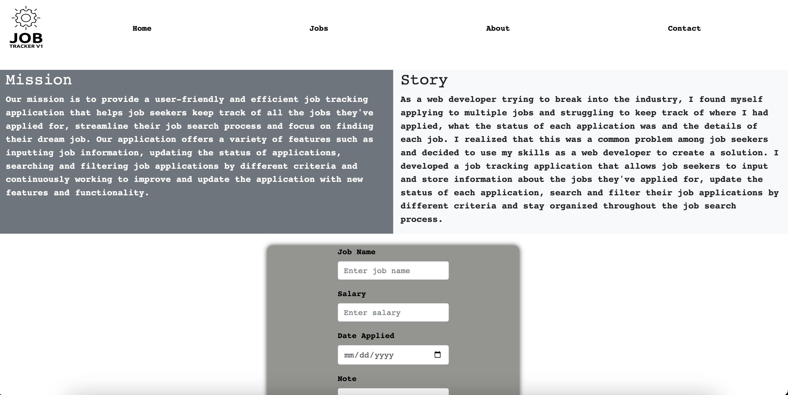

# Job-Tracker_V1
`The Job Tracker application is a tool that allows users to keep track of job opportunities that they have applied for. Users can create a job listing by providing information such as the job name, salary, date applied, and notes. The application stores these job listings in a table that can be viewed by the user. Users can also edit or delete job listings as needed. Additionally, users can also search and filter through their job listings based on different criteria. The application allows users to keep track of all their job applications in one place and to have a clear overview of their job hunting progress. It is a user-friendly and easy to use tool that helps job seekers to stay organized and efficient in their job search.`

# Webpage 
https://carternadain.github.io/Job_Tracker-v1/

# Getting Started
If you'd like to use this job tracker yourself feel free to copy this code you will just git clone the `https` link onto your machine. To clone this you would open your terminal window `cd` where you want the file to go then write `git clone examplelink` then open up the new project in your favorite code writer. 

# Application in use

# Prerequisites
`google chrome`
`vscode`

# Built With 
`javescript`
`bootstrap`
`html`
`css`

# Authors
https://github.com/carternadain